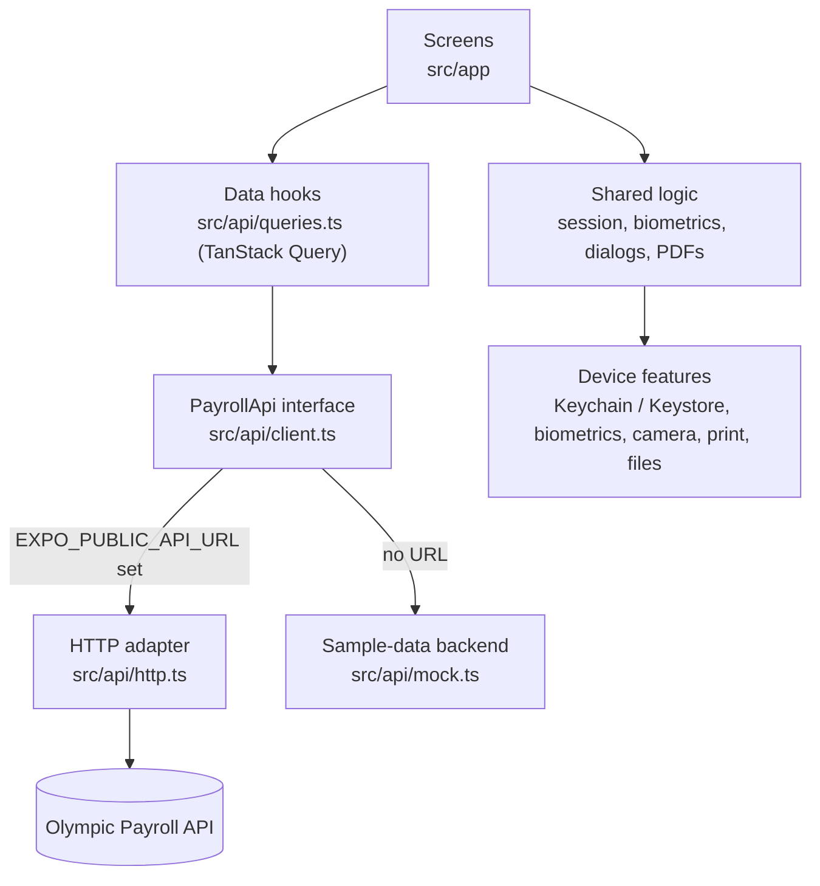

# Olympic Paycheck — Mobile App Rebuild

A complete rebuild of **Olympic Paycheck**, Olympic Payroll's employee pay-stub app, as a modern cross-platform app for **iPhone and Android** from a single codebase.

The original app was written in Objective-C for iPhone only (version 1.2.4, 2013–2014) and depended on a web service that has since been retired. This project replaces it with a React Native (Expo) and TypeScript app. It keeps every feature of the original, adds W-2 tax documents, PDF downloads and fingerprint or Face ID sign-in, and is ready to connect to Olympic Payroll's current backend.

| | |
|---|---|
| **Platforms** | Android and iOS, one codebase |
| **Status** | Feature-complete on sample data; tested on Android phones; waiting for the production API |
| **Stack** | Expo SDK 54 · React Native 0.81 · React 19.1 · TypeScript 5.9 |
| **Quality** | 369 automated tests in 19 suites · strict TypeScript · lint-clean |
| **Size** | about 6,200 lines of application code and 3,500 lines of tests |
| **Branch** | `Test` |

---

## Contents

1. [What the app does](#1-what-the-app-does)
2. [Technology stack](#2-technology-stack)
3. [Architecture](#3-architecture)
4. [Features in detail](#4-features-in-detail)
5. [Security and privacy](#5-security-and-privacy)
6. [Backend integration](#6-backend-integration)
7. [Quality and testing](#7-quality-and-testing)
8. [Builds and distribution](#8-builds-and-distribution)
9. [Getting started for developers](#9-getting-started-for-developers)
10. [Project history](#10-project-history)
11. [Open items and next steps](#11-open-items-and-next-steps)
12. [Repository layout](#12-repository-layout)

---

## 1. What the app does

Olympic Paycheck lets an employee of an Olympic Payroll client view their own pay information on their phone. It is an employee self-service viewer, not a payroll-processing tool.

**What an employee can do:**

- Sign in with their email address and the last four digits of their Social Security number. After that, sign in with a fingerprint or Face ID.
- If they are paid by more than one employer, choose which one to view, and switch between them later.
- See their latest pay on a dashboard, with a "NEW" badge until it has been opened.
- Browse their pay history by year, including pay dates with several checks and combined checks.
- Open any pay stub: earnings, taxes, deductions and net pay, for the check and year to date.
- Email a copy of a stub, or download it as a PDF.
- View their W-2 forms box by box, with plain-English explanations, and download them as PDFs.
- Take or choose a profile photo.

The app signs the employee out after five minutes of inactivity, as the original did.

---

## 2. Technology stack

### Application

| Area | Technology | Version | Purpose |
|---|---|---|---|
| Framework | [Expo](https://expo.dev) (managed workflow) | SDK 54.0.36 | Cross-platform native app, builds and native modules without hand-maintained Xcode or Android Studio projects |
| UI runtime | React Native | 0.81.5 | Native iOS and Android user interface |
| UI library | React | 19.1.0 | Components and state, with the React Compiler enabled |
| Language | TypeScript | 5.9 | Strict typing across the whole codebase |
| Navigation | Expo Router | 6.0 | File-based routes with typed route checking |
| Server data | TanStack Query | 5 | Caching, loading and error states, and refetching of payroll data |
| Animation | React Native Reanimated | 4.1 | Screen and list animations that run on the UI thread |
| Graphics | React Native SVG | 15.12 | Icons and illustrations |

### Device capabilities

| Capability | Technology | Used for |
|---|---|---|
| Biometrics | expo-local-authentication 17 | Fingerprint and Face ID sign-in |
| Secure storage | expo-secure-store 15 | Keychain (iOS) and Keystore (Android) storage for the saved sign-in |
| Camera and photos | expo-image-picker 17 | Profile photo |
| PDF rendering | expo-print 15 | Turning pay stubs and W-2s into PDFs on the phone |
| Sharing | expo-sharing 14 | The system share sheet for PDFs |
| Files | expo-file-system 19 | Saving PDFs to a folder the employee chooses (Android) |
| Opening PDFs | Custom native module in Kotlin (`modules/pdf-viewer`) | Opening a saved PDF in the phone's PDF viewer |
| Images | expo-image 3 | Logo and photo display |

### Tooling

| Area | Technology |
|---|---|
| Testing | Jest 29 with jest-expo, and React Native Testing Library 14 |
| Linting | ESLint 9 (flat config) with eslint-config-expo |
| Type checking | `tsc --noEmit` in strict mode |
| Builds | EAS Build: cloud builds of installable Android APKs, and store builds |
| Version control | Git and GitHub |

---

## 3. Architecture

### How the pieces fit



**The main design decision** is that no screen knows where its data comes from. Every screen uses the data hooks, and the hooks call a single interface, `PayrollApi`. Two implementations exist:

- **`http.ts`** talks to the payroll service over HTTPS. It is used whenever `EXPO_PUBLIC_API_URL` is set.
- **`mock.ts`** is a realistic sample-data backend. It is used for demos and tests until the production API is available, and the app then shows a "SAMPLE DATA" banner.

The two are never mixed. Connecting the real backend means adjusting one file (`http.ts`) to match its exact paths and fields, with no changes to any screen.

### Screens

| Route | Screen |
|---|---|
| `/` | Sign in (email and SSN) |
| `/unlock` | Fingerprint or Face ID unlock |
| `/companies` | Choose an employer |
| `/home` | Dashboard: latest pay and shortcuts |
| `/history` | Pay history by year |
| `/profile` | Photo, employer switch, biometric setting, legal, sign out |
| `/checks` | The individual checks on a pay date |
| `/stub` | Pay stub detail (single or combined) |
| `/tax-documents` | Annual tax documents |
| `/w2` | W-2 detail |
| `/legal` | Privacy policy and terms of use |

### Source layout

```
OlympicPaycheckExpo/
├── src/
│   ├── app/            Screens (file-based routes)
│   ├── api/            PayrollApi interface, HTTP adapter, sample-data backend, data hooks, types
│   ├── lib/            Session, biometrics, auto sign-out, session expiry, dialogs, snackbar,
│   │                   PDF rendering and documents, photo, preferences, formatting
│   ├── components/     Header, cards, buttons, icons, illustrations, loading/error/empty states
│   ├── hooks/          Theme, colour scheme, PDF export
│   └── constants/      Design tokens (colours, spacing, type)
├── modules/pdf-viewer/ Native Android module (Kotlin) for opening PDFs
├── __tests__/          Automated tests
├── assets/             App icon, splash and logo
├── app.json            App configuration (name, identifiers, permissions, plugins)
└── eas.json            Build profiles
```

---

## 4. Features in detail

### Sign-in

- **Email and last four SSN digits**, as in the original app.
- **Escalation and lockout, as in the original.** After two failed attempts the form asks for the full nine-digit SSN, which the server verifies. After three more failures the form locks and tells the employee to call Olympic Payroll.
- **Specific error messages.** An unknown email, a wrong SSN, an email shared by several employees, a network problem and a server problem each get their own message, so the employee knows what to fix.
- **Remember me** keeps the email address only.

### Fingerprint and Face ID

- Offered once, right after a successful sign-in, and optional.
- The saved sign-in lives in the phone's secure hardware storage (Keychain or Keystore), and the operating system only releases it after a successful biometric check. The whole unlock is **one prompt**.
- On Android only **strong (Class 3)** biometrics are accepted, which in practice means fingerprint. The app does not advertise camera face unlock, which Android treats as weak.
- If the phone's enrolled fingerprints or face change, the saved sign-in becomes unreadable. The app explains this and asks the employee to sign in again, rather than looping.
- "Use email instead" and "Forget this device" are always available, and the feature can be turned off in Profile.

### Employers

Employees paid by several Olympic Payroll clients choose an employer after signing in, and can switch in Profile at any time. Everything shown, including history, W-2s and PDFs, is scoped to the selected employer.

### Dashboard and pay history

- The latest pay period, with net pay and a **NEW** badge until it is opened.
- History by year, with a year selector.
- **Pay dates with several checks** (for example a regular check and a bonus) open a list of the individual checks. **Combined checks** open straight into one merged stub.
- Net pay is labelled "deposited" only when it actually was. A bonus paid by paper check says so.

### Pay stubs

- Earnings, taxes and deductions, each itemised, for this check and year to date.
- Includes the New Jersey employee contributions (UI/WF/SWF, DI, FLI), since most Olympic Payroll clients are New Jersey employers.
- **Email a copy** to the address on file, protected against double sends.
- **Download PDF**, described under PDFs below.

### Annual tax documents (W-2)

- A list of W-2s by year. The current year appears as **pending**, with the date it will be ready (January 31, or the next business day).
- A W-2 screen showing every box with its official label, and plain-English explanations of box 12 and box 14 codes.
- The SSN is always shown **truncated** (`XXX-XX-1234`), as the IRS allows on employee copies.

### PDFs

- Pay stubs and W-2s are rendered as PDFs **on the phone**. Nothing is uploaded.
- The pay stub PDF carries the Olympic torch logo, earnings, taxes, deductions and a this-check versus year-to-date summary.
- The W-2 PDF follows the official employee-copy layout: Copies B and C on page 1, and Copy 2 with the notice to employee on page 2.
- On Android the employee can **save to a folder they choose**, such as Downloads. A bar then offers **Open**, which opens the file in the phone's PDF viewer. Alternatively they can share it.
- On iPhone the share sheet offers Save to Files, Mail and other apps.
- PDFs made from sample data are watermarked "SAMPLE".

### Profile

Profile photo (take a photo or choose one), switch employer, turn biometric sign-in on or off, privacy policy and terms of use, and sign out.

### Automatic sign-out

The employee is signed out after **five minutes** without a touch, or when the app has been in the background for more than five minutes. When connected to the real service, an expired server session also signs the employee out once and explains why.

### Design and accessibility

- The visual style matches **Olympic Employee Access**, the company's current app: a blue identity header with the employee's photo and employer, large page titles, white pages and a rounded tab bar.
- Every colour, spacing value and type style comes from one design-token file (`src/constants/theme.ts`), so a rebrand is a single-file change.
- Light and dark mode are both supported.
- **Contrast is tested automatically.** A test computes the WCAG contrast ratio of every text and background pairing in both themes, so a palette change cannot ship unreadable text. Twelve failing pairs were found and fixed this way.
- Screen-reader labels are provided on controls, errors are announced, and the confirmation bar is read out and waits for screen-reader users.
- Dialogs are native on each platform: iOS system alerts and action sheets, and Material 3 dialogs on Android.

---

## 5. Security and privacy

| Measure | Detail |
|---|---|
| No full SSN on the device | The full SSN, when asked for, is only sent to the server to be verified. The original app downloaded the employee's real SSN and compared it on the phone; the rebuild deliberately does not. |
| OS-protected saved sign-in | The biometric sign-in is kept in the Keychain or Keystore and released only after biometric authentication, on that device only. |
| Email-only "remember me" | Only the email address is remembered for the sign-in form. |
| Truncated SSNs | W-2 screens and PDFs only ever show the last four digits. If a server response ever contained a full SSN, the app truncates it before any screen sees it. |
| Credentials never in URLs | Sign-in details are sent only in the request body, never in the address, so they cannot end up in server logs. |
| Session token in memory only | The server's session token is never written to storage, and signing out tells the server as well. |
| Validated responses | Every server response is checked before a screen uses it. A malformed reply becomes a clear error message, not a crash. |
| Automatic sign-out | Five minutes of inactivity, or five minutes in the background. |
| No sample data in production | A production build without a real API address refuses to start, so employees can never be shown invented pay. |
| Local PDFs | Documents are created on the phone and leave it only where the employee chooses to save or share them. |

**Recommended next step:** the current biometric design stores the email and last four SSN digits in secure hardware storage. Once the backend can issue a **per-device token**, the app should store that token instead, so that no part of the SSN is kept on the phone. This is described in [BACKEND_API_REQUIREMENTS.md](BACKEND_API_REQUIREMENTS.md) §4.

---

## 6. Backend integration

### Where things stand

- **The original SOAP web service has been retired.** The endpoint the old app used (`myolympicpay.com/WebServices/EmplPayrollInfo.asmx`) now serves the new website and rejects SOAP requests. This was found in the first week, before any code depended on it.
- **The payroll data now sits behind Olympic Payroll's newer backend,** the one used by the myolympicpay.com web portal and Olympic Employee Access. Its API documentation has not yet been provided.
- **The app is built and tested against a realistic sample-data backend**, so every screen could be finished and tested without waiting.

### What is ready

- **`src/api/http.ts`**, a complete HTTP adapter. It handles:
  - sign-in with a bearer token, and sign-out
  - a 20-second request timeout
  - error mapping for every case the screens distinguish
  - response validation, including formats common in .NET services: amounts as text, 1/0 flags, and ISO dates
- **Session expiry handling:** when the server stops accepting the session, the employee is signed out once, returned to the sign-in screen and told why.
- **[BACKEND_API_REQUIREMENTS.md](BACKEND_API_REQUIREMENTS.md)**, a document written for Olympic Payroll's backend developers. It covers:
  - every operation the app needs, mapped to the method the original service provided
  - the data each screen uses
  - authentication, error handling and W-2 delivery
  - a proposed REST contract, a summary of what the company's web portal already calls, and the open questions only their team can answer

### What connecting takes

1. Receive the API address, its documentation and a test login from Olympic Payroll.
2. Match `http.ts` to the real paths and fields. No screen changes.
3. Set `EXPO_PUBLIC_API_URL` in the build profile, then test with real accounts.

Expected effort: one to two days once the documentation is available.

### Sample-data backend

The sample backend behaves like a real payroll history, so the app can be demonstrated and tested convincingly:

- Two employers (Cascade Coffee Roasters and Northgate Catering Co.), with biweekly pay dates from 2023 to 2026.
- Regular pay, overtime, bonus runs, and pay dates with several checks.
- Federal, Social Security, Medicare and New Jersey withholding at the published 2023–2026 rates, stopping at each year's wage base.
- W-2s summed from the same pay stubs the app displays, checked box by box by the tests.

Test shortcuts on the sign-in screen:

| Enter | Result |
|---|---|
| An email containing `unknown` | "Email not recognised" |
| An email containing `shared` | "Email shared by several employees" |
| An email containing `solo` | An employee with a single employer |
| SSN digits `0000` | "SSN doesn't match" |
| Any other email and SSN | An employee with two employers |

---

## 7. Quality and testing

### Automated checks

| Check | Command | Result |
|---|---|---|
| Unit and screen tests | `npm test` | 369 tests in 19 suites, all passing |
| Type checking | `npm run typecheck` | No errors, strict mode |
| Linting | `npm run lint` | No errors or warnings |

### What the tests cover

| Suite | Covers |
|---|---|
| `login` | Sign-in, SSN escalation, lockout, error messages, remember-me |
| `unlock`, `biometrics` | Biometric enrolment and unlock, cancellations, lockouts, invalidated sign-ins, platform differences |
| `session`, `auto-logoff`, `session-expiry` | Session state, automatic sign-out, server session expiry |
| `history`, `payroll-navigation` | Year selection, multi-check and combined-check navigation, switching employer |
| `stub` | Pay stub content, net versus deposited labels, email, PDF download |
| `tax-documents`, `tax-documents-api` | W-2 list and detail, PDF save, share and open, W-2 totals checked against the pay stubs |
| `payroll-api` | The sample backend's payroll arithmetic, including New Jersey contribution limits |
| `http-api` | The HTTP adapter against a stand-in service: every request, token handling, errors, timeouts and response validation |
| `client` | Choosing between the real and sample backends, and the production guard |
| `dialog`, `snackbar` | Native dialogs, the confirmation bar, timing and screen-reader behaviour |
| `contrast` | WCAG contrast of every colour pairing in light and dark mode |
| `format`, `errors` | Currency, names, dates, and user-facing error text |

### Testing on real devices

Each round of work was installed on Android phones as an EAS preview build and tested by hand. Several problems found on devices shaped the design:

- **Biometric labelling.** Most Android phones report both face and fingerprint support, but camera face unlock is rejected by a strong biometric prompt. The app now asks for fingerprint on Android and labels it honestly.
- **A double biometric prompt on iPhone** caused Face ID to fail. Every biometric prompt now runs one at a time.
- **A dependency crash at startup.** An unused package had been resolved to a pre-release build whose native code did not match SDK 54, and it crashed the app before it could start. It was identified and removed.
- **The logo was missing from PDFs in release builds.** The logo is now embedded in the document itself.
- **Opening a PDF could get stuck after the first time.** The off-the-shelf launcher waited for the viewer to report back, which some viewers never do. This was replaced with a small native Android module that does not wait.

---

## 8. Builds and distribution

Builds are produced with **EAS Build**, Expo's cloud build service. The project is `olympic-paycheck` on Expo.

| Profile | Output | Data | Use |
|---|---|---|---|
| `preview` | Installable Android APK | Sample data allowed | Internal testing and demos |
| `development` | Development build APK | — | Development with native features |
| `production` | Android App Bundle, and iOS store build | Real API required | Store submission |

```bash
cd OlympicPaycheckExpo
npx eas-cli build --platform android --profile preview
```

The build page on expo.dev gives a download link and QR code for installing the APK on a phone.

**App identifiers:** the app is named "Olympic Paycheck", and the bundle identifier and package are currently `com.olympicpayroll.paycheck`. This identifier is a placeholder until it is decided whether the app replaces the existing App Store listing or ships as a new one (see open items).

---

## 9. Getting started for developers

```bash
cd OlympicPaycheckExpo
npm install
npx expo start        # development server; scan the QR code with Expo Go or a development build
npm test              # run the tests
npm run typecheck     # TypeScript check
npm run lint          # ESLint
```

Requirements, configuration variables and code conventions are in [OlympicPaycheckExpo/README.md](OlympicPaycheckExpo/README.md). The main points:

- The project is pinned to **Expo SDK 54**. Install packages with `npx expo install` so the versions match.
- Fingerprint and Face ID, and opening PDFs on Android, need an EAS build. Expo Go does not include that native code.
- Screens use the hooks in `src/api/queries.ts`. They never call a backend directly.

---

## 10. Project history

### Phase 1 — Discovery and planning (late July 2026)

- Read through the complete Objective-C source of the original app: about 15 screens and the 11 web-service methods behind them.
- Probed the original web service and found it **retired**. The company's data has moved to a new backend, so the plan changed before any code depended on the old service.
- Researched Olympic Payroll's brand and its current app, Olympic Employee Access, to set the visual direction and colour palette.
- Wrote the [rebuild plan](REACT_MIGRATION_PLAN.md): an 8-week schedule, architecture, risks, and the decisions needed from management.
- Chose **Expo SDK 54** so the app runs on the Expo Go version on the team's phones, and it is fully supported for store builds.

### Phase 2 — Foundation and feature parity (committed 1 August 2026)

- Built the app from scratch: navigation, design system, API layer and every screen of the original.
- Added fingerprint and Face ID sign-in, the multi-employer picker, pay history with multi-check and combined checks, stub detail with this-check and year-to-date figures, profile photo, and automatic sign-out.
- Replaced the placeholder torch with the company's real logo, extracted from the original app's graphics.
- Restyled the app twice to match Olympic Employee Access.
- Set up the test suite: **176 tests**. They found and fixed arithmetic inconsistencies in the sample data, and **12 colour pairings that failed accessibility contrast**.
- Found and removed a pre-release dependency that crashed the app at startup.

### Phase 3 — Backend requirements (committed 1 August 2026)

- Wrote [BACKEND_API_REQUIREMENTS.md](BACKEND_API_REQUIREMENTS.md) for Olympic Payroll's backend team: the operations the app needs, the data shapes, and specific questions.
- It raises two decisions: never letting the API return an SSN, and a per-device token for biometric sign-in.

### Phase 4 — Hardening (committed 10 September 2026)

- **Biometric sign-in:**
  - the saved sign-in moved behind the operating system's biometric gate
  - unlocking now takes a single prompt
  - a changed fingerprint or face set is handled cleanly
  - Android requires strong biometrics
  - the "Use email instead" fallback was fixed
- **Payroll navigation:** the dashboard and history share one navigation rule. Delivery ids are kept separate from pay-period ids. Email a stub reports failures, can be retried and cannot send twice. Employees with no history are handled.
- **Backend selection** moved to configuration (`EXPO_PUBLIC_API_URL`), with a startup guard so sample data can never reach a production build.
- **290 tests.**

### Phase 5 — Annual tax documents and PDFs (committed 11 September 2026)

- Added the **Annual Tax Documents** section and the W-2 screen, with official box labels and plain-English explanations.
- Added **Download PDF** for pay stubs and W-2s, rendered on the phone. The W-2 follows the official employee-copy layout.
- Made the sample data more realistic: New Jersey UI/WF/SWF, DI and FLI withholding at the published rates and wage bases, and W-2s summed from the same stubs.
- **336 tests.**

### Phase 6 — Backend readiness and finishing touches (committed 11–12 September 2026)

- Added the **Open** button after saving a PDF on Android, using a custom native Kotlin module.
- Embedded the logo in PDFs so it appears in release builds.
- Wrote the complete **HTTP adapter** for the payroll API: token handling, time-outs, error mapping and response validation.
- Added server **session-expiry** handling, and sign-out now informs the server.
- Studied the company's web portal to document which backend calls it already makes, including existing endpoints that produce official pay stub and W-2 PDFs.
- Accessibility work on the confirmation bar: it is read out on iOS, waits for screen-reader users, and respects Android's "Time to take action" setting.
- Worked through several code review rounds and fixed every confirmed finding.
- **369 tests.** Verified on an Android phone.

---

## 11. Open items and next steps

### Needed from Olympic Payroll

| Item | Why it matters |
|---|---|
| **API address, documentation and a test login** for the current backend | The only step between the app and real payroll data. See [BACKEND_API_REQUIREMENTS.md](BACKEND_API_REQUIREMENTS.md). |
| **Apple Developer and Google Play account access** | Needed for iPhone testing (including Face ID) and for store submission. |
| **Replace the existing App Store app, or publish a new one?** | Replacing "Olympic Paycheck" (App Store id 882047987) requires the original app's bundle identifier. |
| **Approval of the privacy policy and terms of use** | The in-app text is a draft, marked as pending review. |
| **High-resolution or vector logo** | The store icon needs a crisp 1024 × 1024 image. |
| **Brand colour sign-off** | The palette was derived from the company's websites and apps, not from an official brand guide. |
| **Licence for the app code** | `OlympicPaycheckExpo/LICENSE` is still the MIT licence from the Expo project template. It should be replaced with the company's terms. |

### Planned next steps

1. Connect the app to the production API, then test with real employee accounts.
2. Test on iPhone once the Apple account is available.
3. Once the backend supports it, move biometric sign-in to a per-device token, and show the official PDFs the payroll system already produces.
4. Create the store listings (screenshots, descriptions, privacy details), make the production builds and submit.

---

## 12. Repository layout

| Path | Contents |
|---|---|
| [`OlympicPaycheckExpo/`](OlympicPaycheckExpo/) | **The new app** (React Native / Expo) |
| [`BACKEND_API_REQUIREMENTS.md`](BACKEND_API_REQUIREMENTS.md) | Requirements and proposed contract for the payroll API |
| [`REACT_MIGRATION_PLAN.md`](REACT_MIGRATION_PLAN.md) | The original rebuild plan and research |
| `EemployeePayroll/`, `Olympic Pay.xcodeproj`, `OLY*.h`, `OLY*.m` | The original Objective-C iPhone app (2013–2014), kept for reference |
